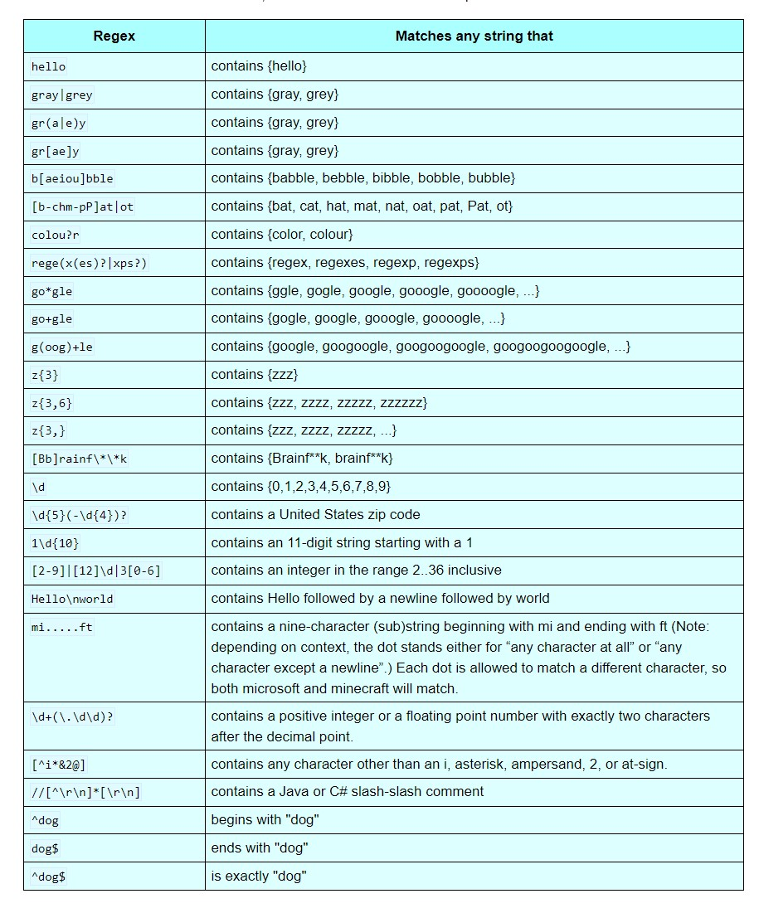

# **Beginners Introduction to Regex**
## Introduction
To begin, regex is a collection of characters that when used help find, replace or validate different values. A simplified explanation of regex would be an advanced way of filtering through data. With this document, I aim to show the basics of regex and give a beginner's level tutorial on how it can be used.

## Links
*[Introduction](#introduction)
*[Basics](##regex-basics)
*[Basic Examples](##basic-examples)
*[Tutorial](##real-world-example-/-tutorial)
*[Conclusion](##conclusion)
*[Author](##wrote-by)

## Regex Basics
When given a string regex can be used to filter through said string and return, or validate for specific information that the user is looking for. For an example we'll use the string:

"The quick brown fox jumped over the lazy dog."

First, to begin using regex we use the / to open the expression and another / at the end to close the expression indicating everything in the middle is going to be executed by regex.
Now as a developer, we can use the regex expression **/b/** to check the string to see if it contains the letter "b".
Similarly we can use the expression /brown/ to check if the string contains the word brown.

Now given a different string of:

**"brown, frown, crown, drown"**

We could use the **.** symbol to match for all of the items in the string by writing **/.rown/**. The dot symbol in regex is used to return for anything that would be in its place.
Some other commonly used symbols in regex are **^ & {} [] |** and so on. However if given a string like:

**"(My) Name^Is Tr|stan"**

and if we wanted to check the string to see if it contains these symbols we would run into some issues.
In regex the **()** symbol is used to group one or more regular expressions, and the **|** symbol is used similar to in JavaScript as an or symbol. An example is if we were to check if a web application contained a .com or .org we could write that as **(com | org)**.
The way to bypass this in regex is by using \ at the start of your expression. For the string above in order to check for the **|** symbol we would write that as **/\|/** thus indicating that in this expression we don't want the pipe symbol to be recognized as a regex expression, but rather that we are using the expression to search for the symbol.

## Basic Examples
Here are more basic examples of simple regex expressions:

Credit to [cs.lmu.edu](https://cs.lmu.edu/~ray/notes/regex/) for the graph.

## Real World Example / Tutorial
Now that I've given the basics of regex, I will demonstrate how we can use this with a real world example.
If we wanted to validate if the string given below is a phone number:

**1234567890**

We could start by using the expression **/\d{10}/** The \d in this scenario is checking for digits and the {10} is to confirm that there are 10 in a row.
Now what if the phone number is written:

**123-456-7890**

Here we can use **/\d{3}-?\d{3}-?\d{4}/** now searching for the included hyphen, and the addition of the question mark indicating that it is optional.
To take it a step further, we can also check if the phone number is wrote with spaces instead of using a dash as follows:

**123 456 7890**

To build off of the previous example we can write the new regex expression as **/\d{3}[ -]?\d{3}[ -]?\d{4}/** with the addition of [ -]? rather than the previous -?. Now indicating that we are checking for everything within the brackets; in this case it is the addition of the space.

## Conclusion
Hopefully with the examples given I have shown the basics of how to use regex. Feel free to edit the document if you see any errors or have something you would like to add!

## Wrote by
Tristan Hanson, Web development student [Github](https://github.com/Tristan-Hanson)
